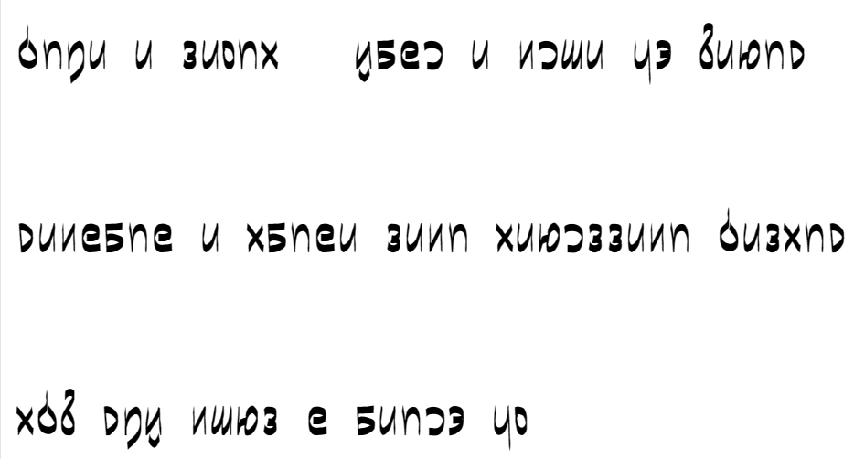

# vertical brush pmcp font【層圧島集倉字】

<!-- 

pbm csxz tdnl kgh aeiuo jw 01234 56789 .,?!-"  
mugaxiju e belpic? mak-mak doktit nuwaxecleti "zo". hata, setija!

Available in [TTF](https://github.com/sozysozbot/vertical_brush_pmcp_font/blob/master/fonts/????.ttf) and [WOFF](https://github.com/sozysozbot/vertical_brush_pmcp_font/blob/master/fonts/????.woff). -->


## ビルド方法

```shell
npm install
npx tsc
node to_font.js
```

## ファイル構成

vertical_pmcp.svg は下書き。本編画像は glyphs/ フォルダに置かれる予定。
